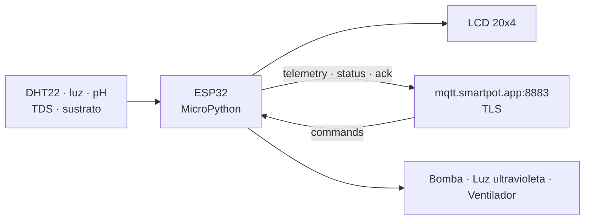

# SmartPot-IoT

## Estado del Proyecto

[](https://github.com/SmartPotTech/SmartPot-IoT/actions/workflows/ci.yml)
[](https://github.com/SmartPotTech/SmartPot-IoT/actions/workflows/codeql.yml)

## Descripción

SmartPot-IoT es el **firmware del dispositivo de un cultivo real**: MicroPython 1.23 sobre un ESP32, simulado en [Wokwi](https://wokwi.com/projects/408863167711709185) o grabado en una placa física. Lee los sensores, muestra los valores en una pantalla LCD, publica la telemetría por **MQTT sobre TLS** y ejecuta los comandos que llegan desde SmartPot, confirmando cada uno.

Con placa o en Wokwi, el cultivo es **real** para SmartPot: sus lecturas vienen de este firmware y entrenan el aprendizaje continuo. ¿Sin hardware ni Wokwi abierto? Crea en la PWA un **cultivo virtual**: lo simula [SmartPot-DataGenerator](https://github.com/SmartPotTech/SmartPot-DataGenerator) con el mismo contrato, y no se puede convertir en real después.



## Circuito

| Componente | Pin ESP32 | Escala enviada |
| --- | --- | --- |
| DHT22 (temperatura y humedad del aire) | GPIO 15 | °C y % |
| Sensor de luz (potenciómetro en Wokwi) | GPIO 34 | 0–2000 lux |
| Sensor de pH | GPIO 35 | 0–14 |
| Sensor de TDS | GPIO 32 | 0–3000 ppm |
| Humedad del sustrato | GPIO 33 | 0–100 % |
| Bomba de agua (LED azul) | GPIO 19 | `WATER_PUMP` |
| Luz ultravioleta (LED morado) | GPIO 18 | `UV_LIGHT` |
| Ventilador (LED naranja) | GPIO 5 | `FAN` |
| LCD 20x4 I2C | SCL 16 · SDA 17 | — |

## Estructura del Proyecto

```text
SmartPot-IoT/
├── fs/                      # Sistema de archivos del ESP32
│   ├── main.py              # WiFi, NTP, MQTT, lecturas y comandos
│   ├── smartpot_client.py   # Contrato MQTT v1: tópicos, telemetría, comandos y ACK
│   ├── sensors.py           # Sensores analógicos y DHT22
│   ├── actuators.py         # Actuadores con apagado automático por duración
│   ├── display.py           # Pantalla LCD
│   ├── utils.py             # Hora por NTP y tabla por consola
│   ├── config.example.py    # Plantilla de config.py (no se versiona) con la CA del broker
│   └── i2c_lcd.py, lcd_api.py
├── tests/                   # Pruebas con CPython y módulos de MicroPython simulados
├── diagram.json             # Circuito de Wokwi
├── wokwi.toml               # Firmware para la simulación local
├── start.py                 # Ejecuta el firmware en la simulación local con mpremote
└── pyproject.toml / uv.lock # Herramientas de desarrollo (mpremote, pytest, ruff)
```

## Contrato MQTT

El dispositivo se conecta a `mqtt.smartpot.app:8883` con TLS (1.2 o superior), verifica el certificado del broker con la CA pública de SmartPot, que viaja en `config.py` (`BROKER["CA_CRT"]`), y se autentica con **usuario = id del cultivo** y la **clave del dispositivo**. El client id es `smartpot-<cropId>` (el broker rechaza ids vacíos).

| Tópico | Sentido | Ejemplo |
| --- | --- | --- |
| `smartpot/v1/{cropId}/telemetry` | Publica cada 30 s | `{"temperature":23.5,"humidity":61,"brightness":820,"ph":6.12,"tds":790,"soilMoisture":64.2}` |
| `smartpot/v1/{cropId}/commands` | Recibe (QoS 1) | `{"id":"…","actuator":"WATER_PUMP","action":"ACTIVATE","durationSeconds":15}` |
| `smartpot/v1/{cropId}/commands/ack` | Publica (QoS 1) | `{"id":"…","status":"EXECUTED","message":"Bomba de agua encendida por 15 s"}` |
| `smartpot/v1/{cropId}/status` | Retenido y última voluntad | `online` / `offline` |

Con `durationSeconds` el actuador se apaga solo al cumplirse el tiempo; sin él queda encendido hasta recibir `DEACTIVATE`.

## Guía de Instalación

### 1. Crear el cultivo en SmartPot

En [smartpot.app](https://smartpot.app) crea un cultivo **real** y elige su forma (maceta, tubos NFT, torre o balsa). La aplicación muestra **una sola vez** la clave del dispositivo junto con la guía de conexión (ESP32 físico o Wokwi) y el `config.py` listo, con la red WiFi y el id del cultivo; si pierdes la clave, genera una nueva desde la pestaña Dispositivo.

### 2. Configurar el firmware

```bash
cp fs/config.example.py fs/config.py
```

Pega el `config.py` de la guía o completa a mano `WIFI`, `crop_id` y `device_key`; el bloque `BROKER` ya trae la CA del broker. `config.py` está en `.gitignore`: nunca subas la clave al repositorio ni la dejes visible en un proyecto público de Wokwi.

### 3a. Simulación en el navegador

Abre el proyecto de Wokwi, copia los archivos de `fs/` (con tu `config.py`, que ya trae la CA) y el `diagram.json`, y ejecuta. La red `Wokwi-GUEST` tiene salida a Internet.

### 3b. Simulación local (VS Code o wokwi-cli)

```bash
uv sync
# inicia la simulación de Wokwi en VS Code (usa wokwi.toml) y luego:
uv run python start.py
```

`start.py` monta la carpeta `fs` en el ESP32 simulado con `mpremote` y ejecuta `main.py`.

### Pruebas

```bash
uv run ruff check .
uv run pytest
```

Prueban el contrato MQTT, el manejo de comandos y ACK, el apagado por tiempo de los actuadores, la escala de los sensores, la verificación del broker con la CA de la plantilla y el respaldo de TLS en MicroPython anteriores a 1.23.

## Documentación

El firmware solo habla MQTT con el broker; todo lo demás lo decide la plataforma. Su documentación propia está en [`docs/`](docs/SmartPot_IoT_Documentation.md) (también en [DOCX](docs/SmartPot_IoT_Documentation.docx) y [PDF](docs/SmartPot_IoT_Documentation.pdf)), con sus diagramas en [`docs/diagrams`](docs/diagrams): el general del firmware y su circuito, el ciclo principal y la atención de una orden. La [documentación técnica](https://github.com/SmartPotTech/.github/blob/main/docs/SmartPot_Technical_Documentation.md) detalla el contrato MQTT, la conexión con TLS y el circuito. Los diagramas generales muestran la plataforma completa en una sola imagen ampliable:

- [Operación completa](https://github.com/SmartPotTech/.github/blob/main/docs/diagrams/SmartPot_Global_02_Operation_Sequence.svg): la conexión del dispositivo, cada lectura, los comandos con su ACK y la desconexión
- [Máquinas de estado](https://github.com/SmartPotTech/.github/blob/main/docs/diagrams/SmartPot_Global_05_State_Machines.svg): los estados del dispositivo y su cuenta MQTT, y los de un comando
- [Arquitectura completa](https://github.com/SmartPotTech/.github/blob/main/docs/diagrams/SmartPot_Global_01_Architecture.svg): dónde encaja el dispositivo dentro de la plataforma

## Licencia

Este proyecto está bajo la licencia MIT.
