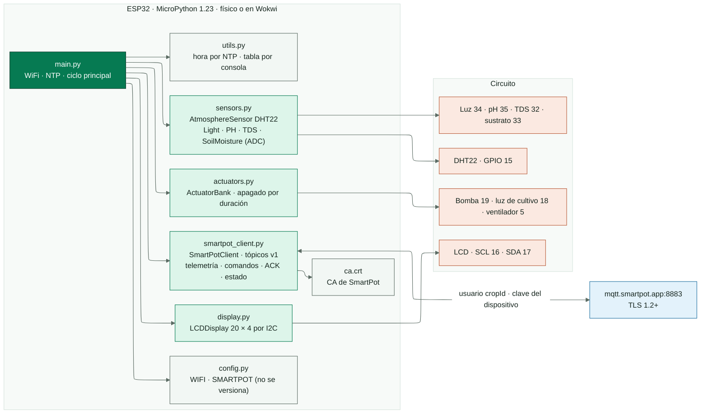
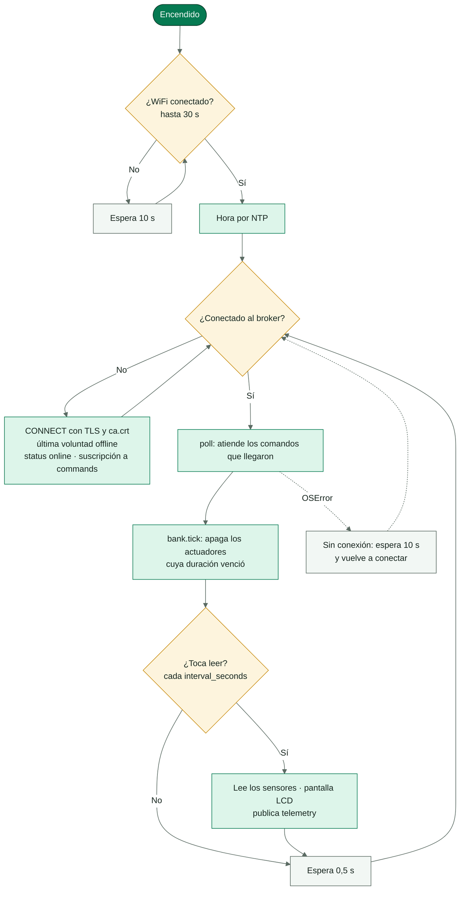
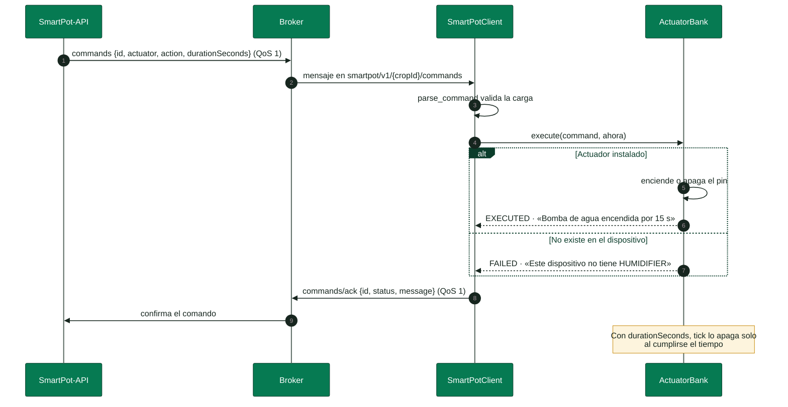

<!-- portada
eyebrow: Documentación del componente
titulo: SmartPot-IoT
acento: IoT
subtitulo: El firmware de un cultivo real
bajada: MicroPython en un ESP32, físico o simulado en Wokwi: sensores, pantalla, actuadores y contrato MQTT v1 con TLS, con su circuito, su ciclo principal, su configuración y sus pruebas.
documento: SmartPot-IoT
version: 1.0 · septiembre 2026
equipo: SmartPotTech
proyecto: smartpot.app
-->

# SmartPot-IoT

## Ficha del documento

| Campo | Valor |
| --- | --- |
| Proyecto | SmartPot · [smartpot.app](https://smartpot.app) |
| Componente | [SmartPot-IoT](https://github.com/SmartPotTech/SmartPot-IoT) |
| Versión | 1.0 · septiembre 2026 |
| Alcance | Circuito, módulos del firmware, ciclo principal, comandos, conexión segura, configuración y pruebas |
| Documentación de la plataforma | [Documentación técnica](https://github.com/SmartPotTech/.github/blob/main/docs/SmartPot_Technical_Documentation.md), [recorrido del proyecto](https://github.com/SmartPotTech/.github/blob/main/docs/SmartPot_Project_Journey.md), [ciclo de vida](https://github.com/SmartPotTech/.github/blob/main/docs/SmartPot_Software_Lifecycle.md) y [diagramas generales](https://github.com/SmartPotTech/.github/blob/main/docs/README.md#diagramas-generales) |
| Mantenimiento | Se genera desde `docs/` de este repositorio con las herramientas de `.github/docs/tools`; se actualiza con cada cambio del componente |

<!-- parte: PARTE I | El componente -->

## 1. Propósito

### En palabras simples

SmartPot-IoT es el programa que corre en el dispositivo de un **cultivo real**: un ESP32 con sus sensores, sus actuadores y una pantalla. Mide, muestra, publica las lecturas en el broker de SmartPot y obedece las órdenes que llegan, confirmando cada una. No decide nada por su cuenta: la API y el asistente deciden. El mismo firmware corre en una placa física o en [Wokwi](https://wokwi.com/projects/408863167711709185), y en los dos casos el cultivo es real para la plataforma; los cultivos virtuales, en cambio, los simula SmartPot-DataGenerator.

## 2. Arquitectura del componente

<!-- diagrama: SmartPot_IoT_Global_Component | titulo=SmartPot-IoT por dentro | lamina=H -->

| Componente | Pin ESP32 | Escala enviada |
| --- | --- | --- |
| DHT22 (temperatura y humedad del aire) | GPIO 15 | °C y % |
| Sensor de luz (potenciómetro en Wokwi) | GPIO 34 | 0–2000 lux |
| Sensor de pH | GPIO 35 | 0–14 |
| Sensor de TDS | GPIO 32 | 0–3000 ppm |
| Humedad del sustrato | GPIO 33 | 0–100 % |
| Bomba de agua | GPIO 19 | `WATER_PUMP` |
| Luz de cultivo | GPIO 18 | `UV_LIGHT` |
| Ventilador | GPIO 5 | `FAN` |
| LCD 20×4 I2C | SCL 16 · SDA 17 | — |

<!-- parte: PARTE II | Funcionamiento -->

## 3. Ciclo principal

<!-- diagrama: SmartPot_IoT_01_Main_Loop | titulo=Ciclo principal del firmware -->

## 4. Comandos

<!-- diagrama: SmartPot_IoT_02_Command_Handling | titulo=Cómo atiende una orden -->

## 5. Conexión segura

| Parámetro | Valor |
| --- | --- |
| Broker | `mqtt.smartpot.app:8883`, MQTT sobre TLS 1.2 o superior |
| Certificado | Firmado por la CA propia de SmartPot; el firmware lo verifica con `ca.crt` |
| Usuario y clave | El id del cultivo y la clave del dispositivo, que la PWA muestra una sola vez al crear el cultivo real o al rotarla |
| Client id | `smartpot-<cropId>` |
| Estado | `online` retenido al conectar y `offline` como última voluntad |

> [!WARNING]
> **Wokwi.** Deja tu copia del proyecto como privada: quien vea `config.py` puede publicar como tu cultivo. Si se filtra, genera una nueva clave desde la pestaña Dispositivo.

<!-- parte: PARTE III | Operación -->

## 6. Configuración

La PWA genera `config.py` en su guía de conexión, con la red WiFi (la tuya o `Wokwi-GUEST`) y el bloque `SMARTPOT` del cultivo. `config.py` no se versiona; `config.example.py` es la plantilla.

| Clave | Uso |
| --- | --- |
| `WIFI.ssid`, `WIFI.password` | Red a la que se conecta el ESP32 |
| `SMARTPOT.crop_id`, `device_key` | Cuenta MQTT del cultivo real |
| `SMARTPOT.host`, `port`, `tls`, `ca_file` | Broker y verificación del certificado |
| `SMARTPOT.interval_seconds` | Segundos entre lecturas (30 por defecto) |

## 7. Pruebas

`uv run ruff check .` y `uv run pytest`: 13 pruebas con CPython y módulos de MicroPython simulados sobre el contrato MQTT, los comandos y su ACK, el apagado por tiempo de los actuadores, la escala de los sensores y el respaldo de TLS en versiones anteriores de MicroPython.

## 8. Puesta en marcha

| Dónde | Pasos |
| --- | --- |
| Placa física | Arma el circuito, graba MicroPython 1.23, copia `fs/` con `mpremote`, agrega `config.py` y `ca.crt` y enciende |
| Wokwi en el navegador | Abre el proyecto, pega `config.py` y `ca.crt` y ejecuta; la red `Wokwi-GUEST` tiene salida a internet |
| Wokwi local | `uv sync`, inicia la simulación con `wokwi.toml` y ejecuta `uv run python start.py` |
